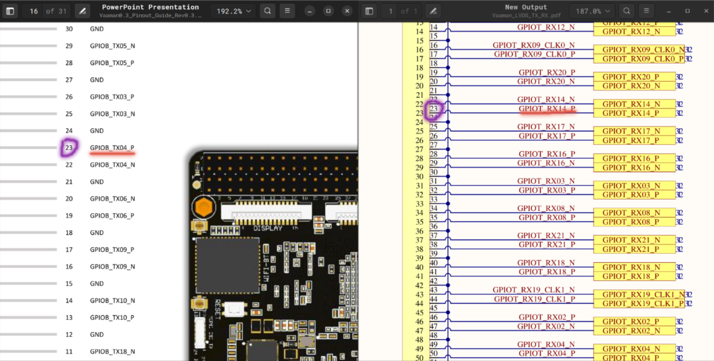

# fpga2fpga
A minimal communication protocol for communication between 2 FPGAs over LVDS PHY.

## Purpose:
To be used when one FPGA is used as a debugger of anothe FPGA.

## How it works:
- There are 2 modules, `fpga1_sender` and `fpga2_receiver`. As the name suggests, both codes will be dumped on respective FPGAs where receiver FPGA will work as a debugger.
- `fpga1_sender`'s LVDS Tx pins will be connected with `fpga2_receiver`'s LVDS Rx pins. **Here LVDS pins are used as GPIOs.**
- Ongoing process on FPGA 1 will give `start` signal to the `fpga1_sender` module and it will take data from the process as input.
- After that, the process is,
    1. `fpga1_sender` will send `req_out` to `fpga2_reciever` to requesting to start the transmission.
    2. `fpga2_receiver` will reply with `rdy_out` signal, telling it is ready to receive the data.
    3. `fpga1_sender` will start sending data. In each cycle, 32 bits of data will be sent.
    4. `fpga2_receiver` will receive 32 bits in each clock cycle.
    5. When all the data is sent, `fpga1_sender` will assert `send_done` signal to let `fpga2_receiver` to let it know that all the data is sent.
    6. `fpga2_receiver` will send acknowledgment with `ack_out` signal that it recieved the data along with the `send_done` signal.
    7. If `fpga1_sender` doesn't get ack., it will resend the data.
    8. Once ack. is received successfully, `done` signal of `fpga1_sender` will asserted, to let the process know that all the data is sent.
- `top.v` is written to test loopback of the process on the same FPGA board.

## Potential Future Issues:
- There are some issues that can occur in future,
    1. CDC issues will occure because 2 different boards will surely have different clocks, either with frequency difference, or phase difference, or both. For that, we will use registers and FIFOs on either side or both the sides.
    2. The interface designer gives warning when we use more than 14 pins of LVDS from the same I/O Bank of potential noise occurence. But there are only 2 banks available for LVDS Tx pins, so we have no option but to use more than 14 pins of the same bank. Currently we are not having noise in Loopback, but it might occur when we are dealing with 2 different FPGAs, given that the cable length will be increased.
    3. Currently working fine for upto 200 MHz clock frequency, without debugger for loopback, giving ~800 MBps speed. Still using it at 100 MHz at ~400 MBps speed keeping in mind that it will be suitable when integrated with Gati. Just in case if you need more speed in future, it can work faster.
    4. Tested on Trion, yet to test with Titanium.

## Keep this in mind:
- For pin assignment in interface designer,
    1. Refer [this PDF](resources/Vaaman0.3_Pinout_Guide_Rev0.3.pdf) for Vaaman's LVDS Pinouts guide.
    2. Refer [this PDF](resources/Vaaman_LVDS_TX_RX.pdf) for the PCB of loopback and map the pins as shown in the image below.\
       
 
 

- The pins will be changed if the PCB of LVDS or the FPGA itself is changed. You need to change it accordingly in the interface designer.
- There will be CDC issues for sure, add/comment out any FIFOs or register as needed.
- I have added comments so you can understand it easily (though the code is no that complex).
